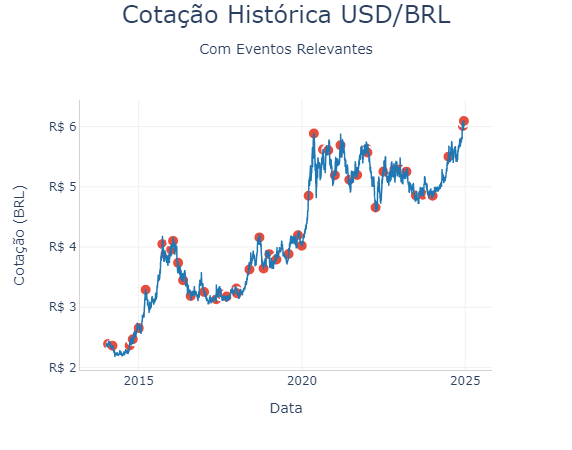

# Análise Histórica USD/BRL 📈



## 📋 Sobre o Projeto

Este projeto apresenta uma análise visual interativa da cotação histórica do dólar americano (USD) em relação ao real brasileiro (BRL), destacando eventos importantes que impactaram a taxa de câmbio entre 2015 e 2025.

## 🚀 Funcionalidades

- Visualização da cotação USD/BRL em série temporal
- Marcadores de eventos relevantes com informações detalhadas
- Gráfico interativo com hover para detalhes
- Integração com dados do Yahoo Finance
- Processamento de eventos históricos via CSV

## 🛠️ Tecnologias Utilizadas

- Python 3.x
- Pandas - Manipulação de dados
- yfinance - Dados financeiros do Yahoo Finance
- Plotly Express - Visualização interativa de dados

## 📦 Dependências

```python
pandas
yfinance
plotly
```

## 🔧 Como Usar

1. Clone o repositório
2. Instale as dependências
3. Execute o script 